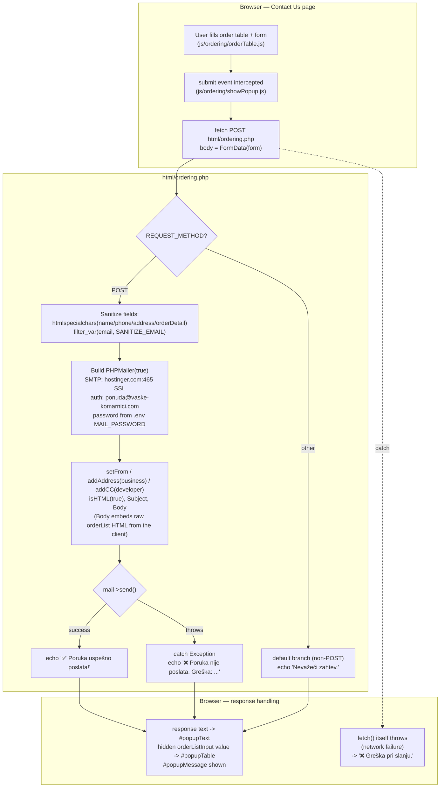

# Ordering — Flow

**About:** [description](../__about/ordering.md)

This is the SERVER half of the ordering flow. The CLIENT half — building the
order list, persisting it across reloads, and posting it here — is
documented separately: [Order Table (flow)](../../js/ordering/__flow/orderTable.md)
builds `#orderList`/the hidden `orderListInput`, and
[Order Memory (flow)](../../js/ordering/__flow/orderMemory.md) is what
survives a reload before the user ever submits. This diagram picks up at
submit.

## Algorithm

Pseudocode (language-neutral):

    ON form submit (js/ordering/showPopup.js):
        preventDefault()
        formData = FormData(form)                 # includes the hidden orderListInput HTML table
        TRY:
            response = fetch(html/ordering.php, POST, formData)
            text = response.text()
            show popup with: text, formData's orderListInput value
        CATCH network error:
            show popup with: "❌ Greška pri slanju."

    ON html/ordering.php request (server):
        IF method != POST:
            RETURN "Nevažeći zahtev."
        sanitize name/phone/address/orderDetail (htmlspecialchars), email (filter_var)
        configure PHPMailer: SMTP host/port/auth, from = ponuda@..., to = business, cc = developer
        body = HTML template embedding the sanitized fields + the RAW orderList HTML (not re-escaped —
               it is server-generated markup from the client's hidden input, not free-text user input)
        TRY:
            mail.send()
            RETURN "✅ Poruka uspešno poslata!"
        CATCH PHPMailer Exception:
            RETURN "❌ Poruka nije poslata. Greška: {mail.ErrorInfo}"

## Notes

- **The `orderList` field is trusted HTML, not escaped again server-side.**
  It is built entirely by
  [Order Table](../../js/ordering/__about/orderTable.md) from DOM
  `textContent` (not raw user typing) into a `<table>` string, so this is a
  deliberate choice, not an oversight — but it means the email body's
  order-table section is exactly whatever HTML the client sent, unescaped.
- **No CSRF token, no rate limiting.** The endpoint accepts any POST from
  anywhere with no origin check — flagged here as observed behavior, not
  fixed (Hard Constraint: zero behavior change on this production site).
  See [Open Questions](../../../OPEN-QUESTIONS.md).
