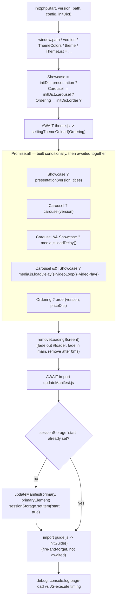

# Init — Flow

**About:** [description](../__about/init.md)

## Algorithm

Pseudocode (language-neutral):

    FUNCTION init(phpStart, version, path, config, initDict):
        expose path, version, theme data on window (every later module reads them from there)
        Showcase = initDict.presentation is set
        Carousel = initDict.carousel is set
        Ordering = initDict.order is set

        AWAIT theme module -> settingThemeOnload(Ordering)   # blocks: page must be themed before content shows

        tasks = []
        IF Showcase: tasks.append( presentation(version, initDict.presentation) )
        IF Carousel: tasks.append( carousel(version) )
        IF Carousel AND Showcase:  tasks.append( media.loadDelay() )              # lazy-load carousel videos only
        IF Carousel AND NOT Showcase: tasks.append( media.loadDelay(); media.videoLoop(); media.videoPlay() )
        IF Ordering: tasks.append( order(version, initDict.order) )
        AWAIT all(tasks)                                      # every requested feature is ready

        removeLoadingScreen()

        AWAIT import updateManifest module
        IF NOT sessionStorage.start:
            updateManifest(current theme colors)               # PWA manifest color-matches the resolved theme, once per session
            sessionStorage.start = true

        import guide module -> initGuide()                     # not awaited: guide-video wiring can lag behind everything else

        IF debug: log page-load time, JS-execute time, viewport size

    SUB-ORCHESTRATORS (each awaits its OWN sub-imports before returning):
        presentation(version, titles):
            AWAIT selectModel module -> selectModel()           # wires color/frame/net click handlers
            IF viewport width > 700: on window 'load', run promoWidth()  # equalize promo-container widths
            media module -> for each title: loadVideo(title); videoPlay(); videoLoop()   # not awaited

        carousel(version):
            import carousel module (drag/wheel)                 # not awaited — self-registers on window 'load'
            import imagePreview module (lightbox)                # not awaited — self-registers on DOM scan

        order(version, priceDict):
            AWAIT orderTable module -> orderTableInit(priceDict) # wires table buttons on window
            showPopup module -> showPopup()                      # not awaited
            import orderMemory module                            # not awaited — self-restores on load

## Notes

- **Two levels of "awaited".** The OUTER `Promise.all` in `init()` waits for
  `presentation()`/`carousel()`/`order()` to RETURN — but each of those
  functions itself fires off further `import().then(...)` calls it does
  NOT await, so "the presentation feature is ready" really only means "the
  click handlers are wired"; the showroom videos and promo-width equalizer
  finish independently, after `init()` has already moved on.
- **`carousel(version)` never awaits its two imports at all** — both
  `js/media/carousel.js` and `js/media/imagePreview.js` are self-registering
  (they run their own `document.querySelector`/`addEventListener` setup at
  module-evaluation time), so there is nothing for the caller to await.
