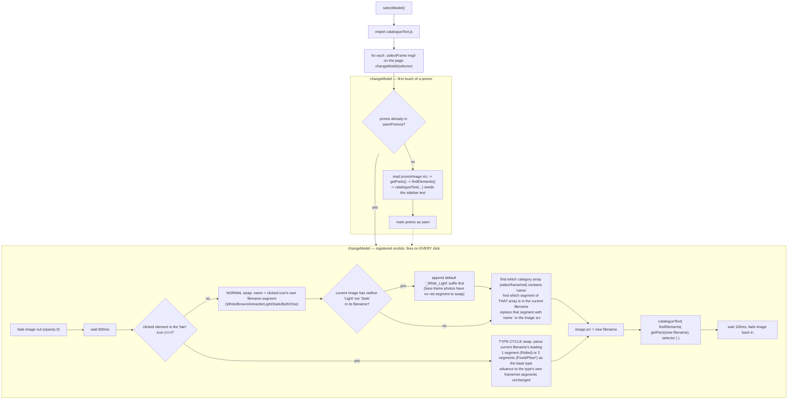
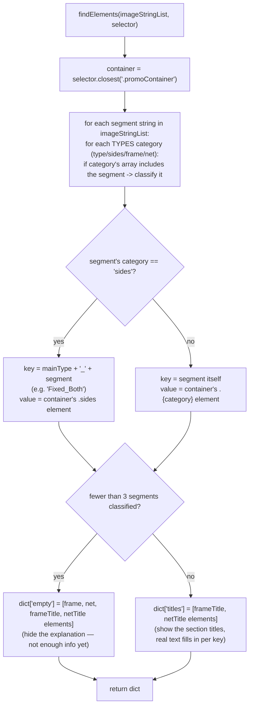

# Select Model — Flow

**About:** [description](../__about/selectModel.md)

## Algorithm

Pseudocode (language-neutral):

    FUNCTION selectModel():
        AWAIT import catalogueText module
        seenPromos = empty set
        FOR EACH selector IN page's '.selectFrame img, .selectFrame i':
            register onclick on selector.parentElement:
                promo = selector's enclosing '.promo'
                IF promo not in seenPromos:
                    seed the promo's explanation text from its CURRENT image
                    mark promo as seen
                fade the promo image out
                AFTER 500ms:
                    IF clicked element is the 'ban' icon (no-selection placeholder):
                        cycle the OVERALL TYPE (Rolled / PliseDoor / PliseWindow / Fixed)
                        keeping the current frame/net/side segments as-is
                    ELSE:
                        name = the clicked icon's OWN segment value
                        IF current image has neither a 'Light' nor 'Dark' segment:
                            normalize it to a default '_White_Light' variant first
                        find which of [sides, frame, net] contains `name`
                        replace the matching segment already in the image filename with `name`
                    new filename -> image.src
                    re-derive the explanation dict from the NEW filename -> catalogueText(...)
                    AFTER 100ms: fade the image back in

    FUNCTION findElements(segments, selector):
        container = selector's enclosing '.promoContainer'
        result = {}
        FOR EACH segment IN segments:
            classify segment against TYPES = {type, sides, frame, net}
            IF category is 'sides': key = mainType + '_' + segment   # e.g. "Fixed_Both"
            ELSE: key = segment
            result[key] = container's matching '.{category}' element
        IF result has fewer than 3 entries:
            result['empty'] = [frame/net/title elements]   # not enough segments recognized — hide the sidebar
        ELSE:
            result['titles'] = [frame/net title elements]  # show section headers; catalogueText fills the rest
        RETURN result

## Notes

- **Two independent click semantics share one handler.** A frame/net/side
  icon click SWAPS one segment within its own category; the `<i>` "ban"
  placeholder icon click instead CYCLES the entire product TYPE — the
  `selector.tagName !== 'I'` check is the only thing distinguishing them.
- **`findElements()`'s `<= 2` / `> 2` branch is a heuristic, not a named
  state.** Fewer than 3 classified segments means the filename did not carry
  enough information to describe frame+net+type+side together (e.g. a
  bare `Fixed_Both.webp` placeholder with no color yet) — the sidebar hides
  rather than showing partial/wrong text.
