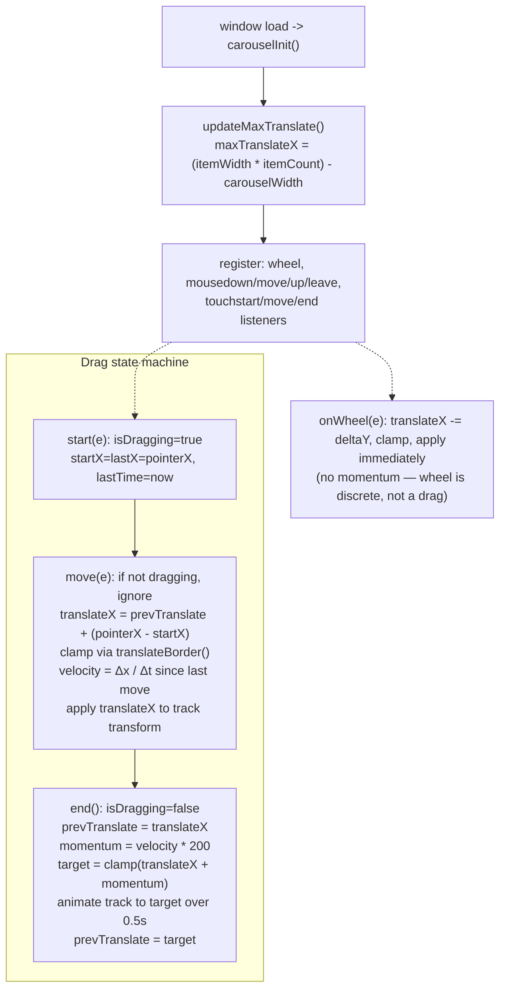

# Media Carousel — Flow

**About:** [description](../__about/carousel.md)

## Algorithm

Pseudocode (language-neutral):

    ON load: measure maxTranslateX = total track width - visible carousel width

    FUNCTION translateBorder(distance):
        clamp distance to [-maxTranslateX, 0]     # cannot drag past either end

    ON drag/touch start:
        remember start position + time

    ON drag/touch move (only while dragging):
        translateX = previous translate + (current position - start position)
        translateX = translateBorder(translateX)
        velocity = (position delta) / (time delta since last move)
        apply translateX to the track transform immediately (no transition)

    ON drag/touch end:
        previous translate = translateX
        momentum distance = velocity * 200                # tunable multiplier
        target = translateBorder(translateX + momentum distance)
        animate track to target over 0.5s, then drop the transition
        previous translate = target

    ON wheel:
        translateX -= wheel delta Y, clamp, apply immediately (no momentum, no animation)

## Notes

- **One shared `translateX`/`prevTranslate` pair drives all three input
  types** (mouse, touch, wheel) — there is no separate state per input
  method, so a mouse drag can be interrupted by a wheel scroll and both
  continue from the same position.
- **Momentum is velocity-based, not a fixed animation.** A fast flick
  travels further than a slow drag release because `momentumDistance =
  velocity * 200` scales directly with the measured release velocity.
