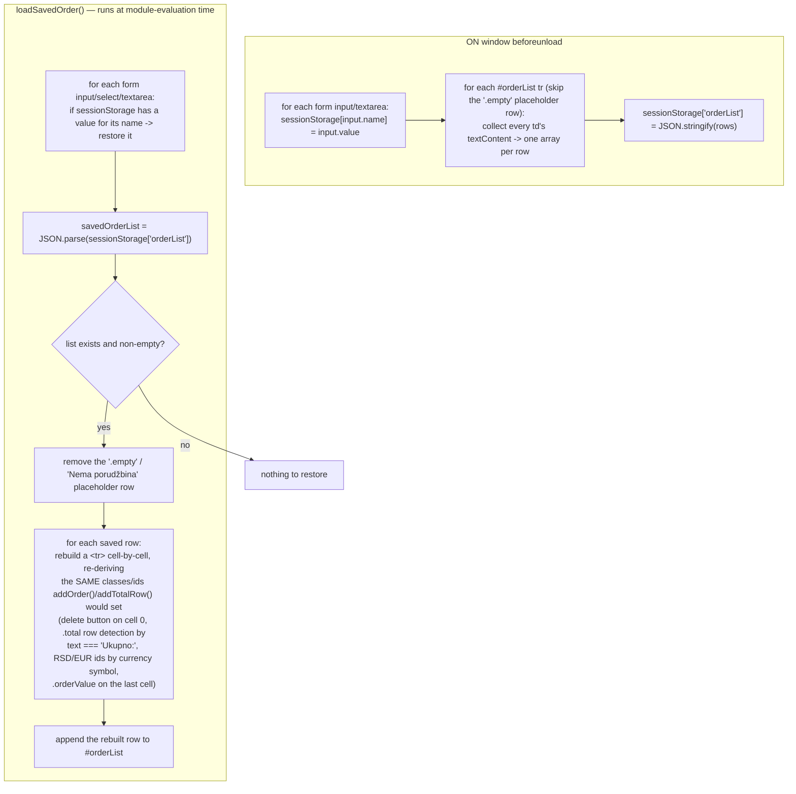

# Order Memory — Flow

**About:** [description](../__about/orderMemory.md)

## Algorithm

Pseudocode (language-neutral):

    ON window beforeunload:
        FOR EACH form input/textarea: sessionStorage[input.name] = input.value
        rows = []
        FOR EACH #orderList row (skip the empty-state row):
            rows.append( [cell.textContent.trim() for cell in row's <td>s] )
        sessionStorage['orderList'] = JSON.stringify(rows)

    FUNCTION loadSavedOrder():
        FOR EACH form input/select/textarea:
            IF sessionStorage has a saved value for its name: restore it
        savedRows = JSON.parse(sessionStorage['orderList'])
        IF savedRows is non-empty:
            remove the empty-state placeholder row
            FOR EACH savedRow IN savedRows:
                build a new <tr>; for each cell text at index i:
                    IF i == 0 AND text == 'Ukupno:':      mark row as the TOTAL row, colspan 2
                    ELIF i == 0:                           rebuild the delete-button cell around the text
                    ELIF row is TOTAL AND text contains 'RSD'/'€':  tag the cell id (totalRSD/totalEUR), colspan 2
                    ELIF i == last index:                  tag the cell .orderValue (the price column)
                    ELSE:                                  plain text cell
                append the rebuilt row to #orderList

    # loadSavedOrder() is called once, unconditionally, at module-evaluation time
    # (see Notes — the readyState branch below it does not actually defer anything)
    IF document.readyState != 'loading': loadSavedOrder()
    ELSE: document.addEventListener('DOMContentLoaded', loadSavedOrder())

## Notes

- **The restore logic is a hand-written MIRROR of
  [Order Table](../__about/orderTable.md)'s `addOrder()`/`addTotalRow()`
  cell shape**, not a shared function — a class/id `addOrder()` starts
  setting on a new row must be matched here by hand for a restored row to
  look and behave identically (e.g. remain deletable via the same
  `deleteOrder(this.closest('tr'))` handler). See
  [Open Questions](../../../OPEN-QUESTIONS.md) for this duplication, flagged
  not fixed.
- **Observed bug, flagged not fixed** (zero behavior change — production
  site): `document.addEventListener('DOMContentLoaded', loadSavedOrder())`
  calls `loadSavedOrder` immediately (the trailing `()` invokes it) and
  passes its return value — a `Promise`, since the function is `async` — as
  the listener, which is not callable. In practice this is harmless: BOTH
  branches of the `if (document.readyState !== 'loading')` check end up
  calling `loadSavedOrder()` synchronously at import time either way, and by
  the time this module is dynamically imported (deep in
  [Init](../../__about/init.md)'s chain) the document has virtually always
  finished loading already. See
  [Open Questions](../../../OPEN-QUESTIONS.md).
