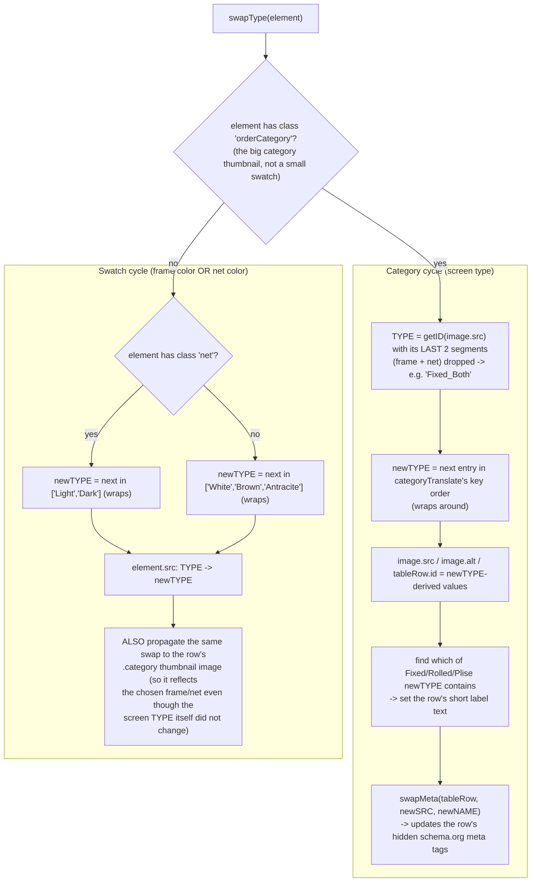
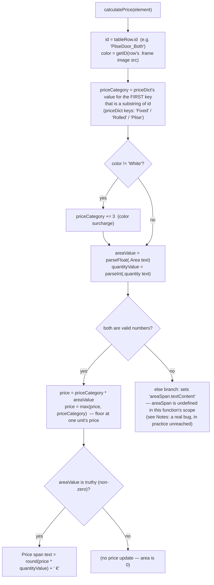

# Order Table — Flow

**About:** [description](../__about/orderTable.md)

## `swapType(element)` — cycle the clicked selector

## `calculatePrice(element)` — price for one row

## Order-list row lifecycle

    FUNCTION addOrder(element):
        read the row's current quantity/area/price/frame/net values
        build a 6-column description (category name, frame+net text, width, height, area, price)
        IF the list was showing the empty-state row: remove it, insert a TOTAL row
        insert the new row just before the TOTAL row (keeps TOTAL always last)
        recompute totalPrice()

    FUNCTION deleteOrder(tableRow):
        remove tableRow
        IF that was the last real row: remove the TOTAL row too, restore the empty-state row
        ELSE: recompute totalPrice()

    FUNCTION totalPrice():
        sum every '.orderValue' cell (each row's price column) across #orderList
        write the sum as both RSD (× a fixed 117.52 conversion rate) and EUR

Pseudocode for `swapType`/`calculatePrice` above; `addOrder`/`deleteOrder`/
`totalPrice` are simple enough that the pseudocode above is the whole
algorithm — a diagram would only restate it.

## Notes

- **`swapType`'s category branch derives "which type is this row" from the
  IMAGE FILENAME, not from any stored value** — `getID()` strips the last
  two `_`-separated segments (assumed to always be frame + net) to recover
  the category id. This is why every product image filename convention
  (`{Category}_{Frame}_{Net}.webp`) must hold for every screen type — a
  filename with a different segment count would silently miscompute `TYPE`.
- **Observed bug, flagged not fixed** (zero behavior change — production
  site): `calculatePrice()`'s `else` branch (area/quantity failed to parse)
  writes to `areaSpan`, a variable that does not exist in this function —
  only `calculateArea()` declares a local of that name. In practice this
  branch is effectively unreachable: both `.Area` and `.quantity` always
  start pre-populated with valid numeric text (`"0 m²"` / `"0"`), so
  `parseFloat`/`parseInt` never actually return `NaN` in normal use. See
  [Open Questions](../../../OPEN-QUESTIONS.md).
- **The color surcharge (+3) and the one-unit price floor are the only two
  pricing RULES** in the whole ordering system — everything else is table
  lookup (`priceDict`, from PHP's `$cenovnik`) and arithmetic.
