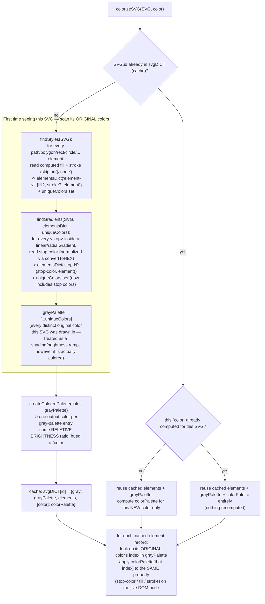
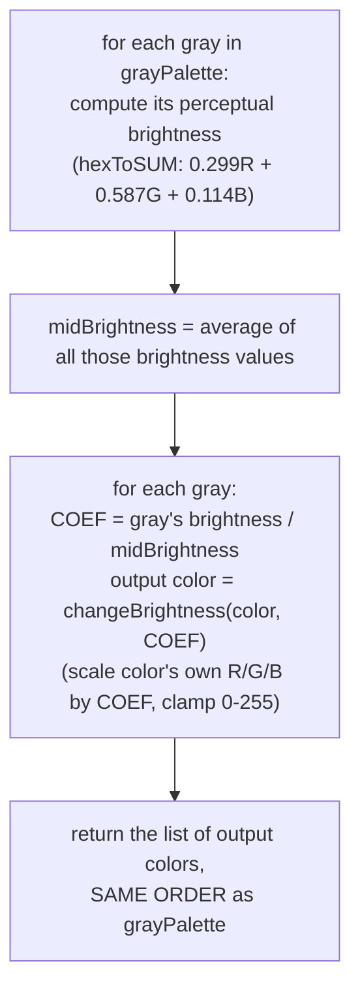

# Colorize SVG — Flow

**About:** [description](../__about/colorizeSVG.md)

## Algorithm

## `createColoredPalette(color, grayPalette)` — the brightness-preserving recolor

Pseudocode (language-neutral):

    FUNCTION createColoredPalette(targetColor, grayPalette):
        brightness[i] = perceptualBrightness(grayPalette[i])  FOR EACH i
        midBrightness = average(brightness)
        FOR EACH gray, i IN grayPalette:
            coefficient = brightness[i] / midBrightness
            outputPalette[i] = scale each RGB channel of targetColor by coefficient, clamped [0,255]
        RETURN outputPalette

    FUNCTION colorizeSVG(SVG, color):
        id = SVG.id
        IF id not cached:
            elements, grayPalette = scan SVG for every original fill/stroke/stop-color (deduplicated)
            colorPalette = createColoredPalette(color, grayPalette)
            cache[id] = { gray: grayPalette, elements, [color]: colorPalette }
        ELIF color not cached for this id:
            reuse cached elements + grayPalette
            colorPalette = createColoredPalette(color, grayPalette)
            cache[id][color] = colorPalette
        ELSE:
            reuse cached elements + grayPalette + colorPalette entirely

        FOR EACH cached element record:
            originalColor = the record's own fill / stroke / stop-color value
            newColor = colorPalette[ index of originalColor in grayPalette ]
            apply newColor to the SAME property on the live SVG DOM node

## Notes

- **"Gray palette" is a naming convention, not a color-space requirement.**
  `grayPalette` holds whatever DISTINCT colors the original SVG actually
  used — the algorithm works correctly on a true grayscale ramp because
  that is what the project's actual logo/icon SVGs are drawn in (a shading
  ramp meant to be recolored), not because the code enforces grayscale
  input.
- **Observed bug, flagged not fixed** (zero behavior change — production
  site): `createColoredPalette()`'s early-return guard
  `if (grayPalette == 1) return Palette.push(color)` compares an ARRAY to
  the number `1` with `==` — this only coerces to `true` if the array's
  string form equals `"1"` (i.e. a single-element array literally
  containing the string `"1"`), never for a one-element array of hex
  colors. The evident intent was `grayPalette.length === 1`; as written,
  this guard never fires and the single-gray case falls through to the
  general loop instead — which still produces a correct one-element
  palette (a loop over one item is equivalent to the intended special
  case), so this is dead code with no observed behavioral effect, not a
  live defect. See [Open Questions](../../../OPEN-QUESTIONS.md).
